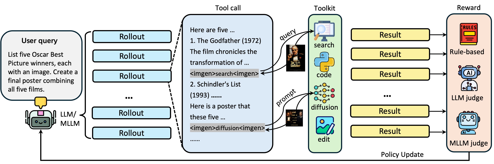
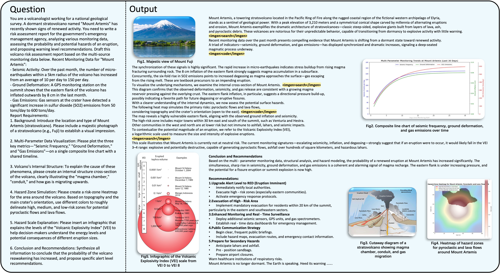

<h1 align="center">LLM-I: LLMs are Naturally Interleaved Multimodal Creators</h1>


<h4 align="center"> Zirun Guo, Feng Zhang, Kai Jia, Tao Jin</h5>


## Overview
We propose LLM-Interleaved (**LLM-I**), a flexible and dynamic framework that reframes interleaved image-text generation as a **tool-use** problem.

We support four types of different tools:

1.  **Online Image Search**: Invoked for requests demanding **factual grounding**, such as specific real-world entities, landmarks, or current events. This tool ensures visual authenticity and provides access to up-to-date information beyond the model's training data cutoff.
2.  **Diffusion-based Generation**: Selected for tasks requiring the **creative synthesis** of novel or abstract concepts, or complex compositions that do not exist in reality.
3.  **Code Execution**: Utilized primarily for generating **data visualizations** like charts, graphs, and plots from structured data.
4.  **Image Editing**: Engaged to perform **modifications** on existing visual content, whether inputted,  retrieved or generated.

<div align="center">

</div>

## Getting Started
### Installation
```bash
# Install basic dependencies
pip install -e .
# Install additional dependencies
pip install -r requirements_llmi.txt
```

### Deployment
**Reward Model**

We use LLM-as-a-Judge and MLLM-as-a-Judge to evaluate the performance of generation.

Start the LLM-as-a-Judge server:
```bash
# Start the LLM-as-a-Judge server
vllm serve Qwen3-235B-A22B-Instruct-2507 \
    --port 18901 \
    --host :: \
    --gpu-memory-utilization 0.8 \
    --max-model-len 32768 \
    --tensor-parallel-size 8 \
    --trust-remote-code \
    --disable-log-requests
```

Start the MLLM-as-a-Judge server:
```bash
# Start the LLM-as-a-Judge server
vllm serve Qwen2.5-VL-72B-Instruct \
    --port 18901 \
    --host :: \
    --gpu-memory-utilization 0.8 \
    --max-model-len 32768 \
    --tensor-parallel-size 8 \
    --served-model-name judge \
    --trust-remote-code \
    --limit-mm-per-prompt image=20\
    --disable-log-requests
```

You can also use other models for LLM-as-a-Judge and MLLM-as-a-Judge.

**Tool Deployment**

If you do not have API key for the tools (Seedream or Seededit), you can deploy Qwen-Image and Qwen-Image-Edit locally instead. If you have, you can skip this step.

Start the Qwen-Image server:
```bash
# Start the Qwen-Image server
```

Start the Qwen-Image-Edit server:
```bash
# Start the Qwen-Image-Edit server
```

### Scripts
**Running Qwen3-4B Model:**
```bash
bash recipe/llmi/llmi_grpo.sh
```
Before you running the script, please make sure all the environment variables are set.
```bash
# for Ray
export RAY_ADDRESS="YOUR_RAY_ADDRESS"
# for seedream and seededit (you can also deploy Qwen-Image and Qwen-Image-Edit locally)
export ARK_API_KEY="YOUR_ARK_API_KEY"
# for Google Search
export SERP_API_KEY="YOUR_SERP_API_KEY"
# Judge
export LLM_JUDGE_BASE_URL="YOUR_LLM_JUDGE_BASE_URL"
export MLLM_JUDGE_BASE_URL="YOUR_MLLM_JUDGE_BASE_URL"
```

We also support Qwen2.5-VL series:
```bash
bash recipe/llmi/mllmi_grpo.sh
```
Before you running the script, please make sure all the environment variables are set.

## Evaluation
<div align="center">

</div>

We use GPT-4o as the evaluator. Before evaluation, please make sure you set the `base_url` and `api_key` in `evaluation/eval_text_only.py` and `evaluation/eval_mm.py`.

Evaluation for LLMs:
```bash
python evaluation/eval_text_only.py --model `<YOUR_MODEL_PATH>`
```

Evaluation for MLLMs:
```bash
python evaluation/eval_text_only.py --model `<YOUR_MODEL_PATH>`
python evaluation/eval_mm.py --model `<YOUR_MODEL_PATH>`
```
